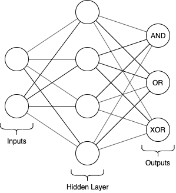

# feedforward-neural-network

A simple implementation of a feedforward neural network with a sigmoid activation function and backpropagation training. While the network can be repurposed to suit simple supervised learning tasks, the default task calculates the bitwise `AND`, `OR` and `XOR` of a two-neuron input, as shown in the diagram below.



## Usage

- Install dependencies: `pip install -r requirements.txt`
- Run: `python neuralnet.py`

```
Training network...
Training complete. Running feedforward pass...
Presenting input: [0, 0]
Expected output: [0, 0, 0]
Network output: [0.00014905 0.02690904 0.03768774]
Network output (rounded): [0. 0. 0.]

Presenting input: [0, 1]
Expected output: [0, 1, 1]
Network output: [0.02010323 0.98059553 0.96490723]
Network output (rounded): [0. 1. 1.]

Presenting input: [1, 0]
Expected output: [0, 1, 1]
Network output: [0.01953619 0.98080554 0.96479895]
Network output (rounded): [0. 1. 1.]

Presenting input: [1, 1]
Expected output: [1, 1, 0]
Network output: [0.97532067 0.99983259 0.03608267]
Network output (rounded): [1. 1. 0.]
```

## Built with

- [Python](https://www.python.org/) - Language
- [Numpy](https://numpy.org/) - Linear algebra library

## License

[MIT license](./LICENSE)
